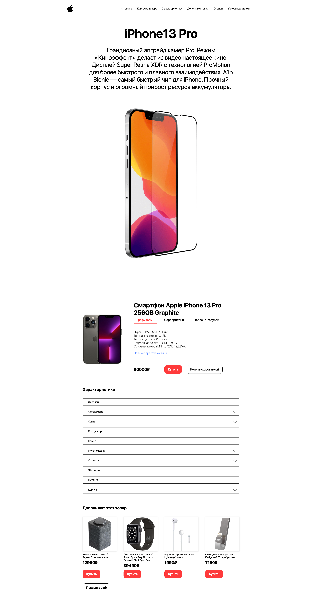

# Project "JavaScript iphone 13"

🔨
In this project, I only studied JavaScript, mastered the syntax and a few tricks with interaction with the page.
On this page, smooth scrolling through the menu, tabs of phone models and tabs of characteristics, there is also a database that contains product cards that can be viewed at the bottom of the page.

